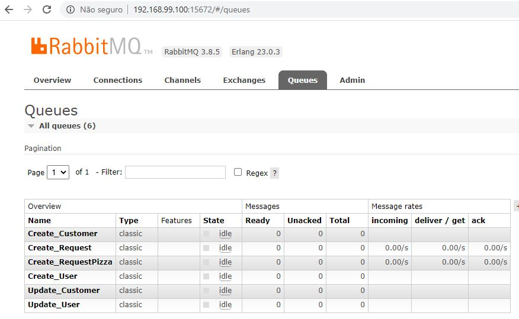
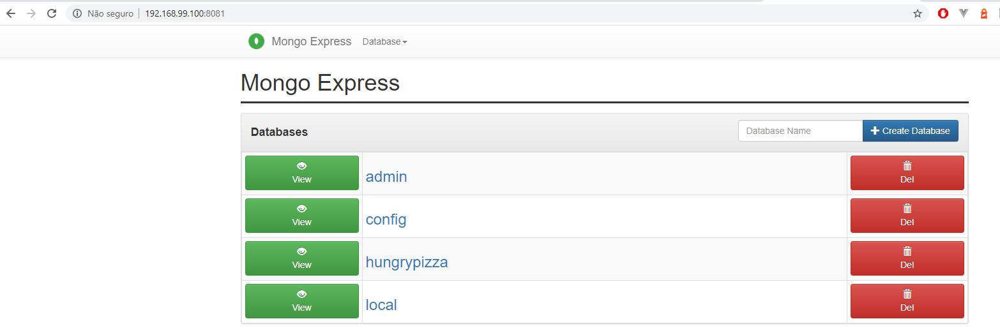
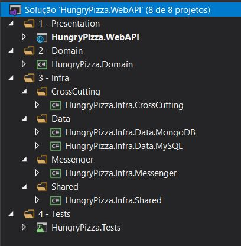
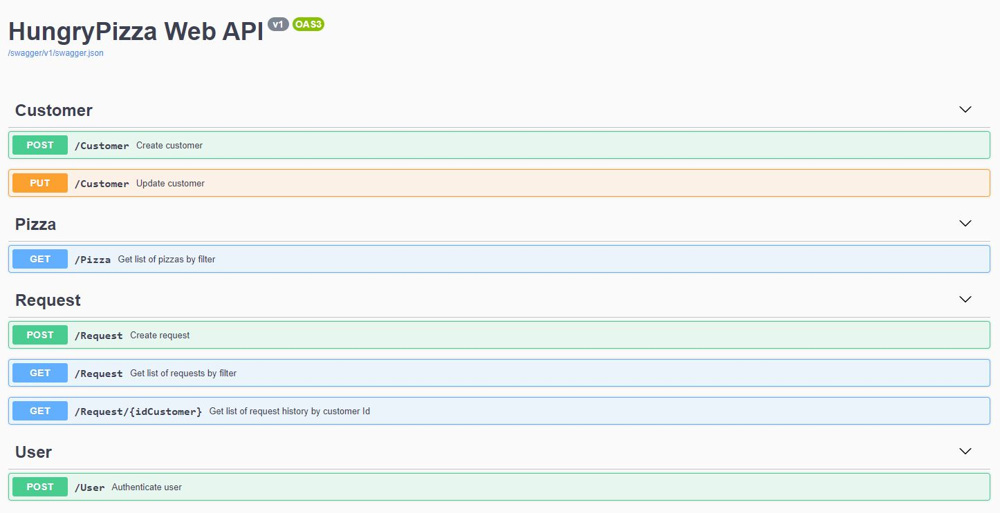

# HungryPizza-RabbitMQ-MongoDB

Versão atualizada do projeto HungryPizza contendo implementação do CQRS com RabbitMQ e MongoDB.
Projeto original: [link](https://github.com/lucianopereira86/HungryPizza)

## OBJETIVO

Criar um repositório com banco de dados não-relacional para leitura (MongoDB) e sincronizá-lo com os dados persistidos no banco de dados de escrita (MySQL) através de um sistema de mensageria assíncrona (RabbitMQ), respeitando o padrão CQRS.

## PROJETOS DA SOLUÇÃO

• **HungryPizza.Domain**: Biblioteca. Contém as entidades, commands, queries, handlers e validações utilizados pelos demais projetos.

• **HungryPizza.Infra.CrossCutting**: Biblioteca. Realiza a injeção de dependência de serviços na camada de Presentation.

• **HungryPizza.Infra.Data**: Biblioteca. Possui classes referentes ao repositório e conexão com o banco de dados MySQL.

• **HungryPizza.Infra.Data.MongoDB**: Biblioteca. Possui classes referentes ao repositório e conexão com o banco de dados MongoDB.

• **HungryPizza.Infra.Messenger**: Biblioteca. Implementa as classes de produção e consumo de mensagens através do RabbitMQ.

• **HungryPizza.Infra.Shared**: Biblioteca. Possui classes comuns a todos os projetos.

• **HungryPizza.Tests**: Testes automatizados. Permite testar os commands, queries e controllers utilizando dados mockados.

• **HungryPizza.WebAPI**: Web API. Permite testar através do Swagger as operações de cadastro e edição de cliente, autenticação de usuário, criação de pedido e listagem de histórico.

## TECH STACK

- .NET Core 3.1
- Swagger
- AutoMapper
- MediatR
- FluentValidation
- Entity Framework
- MySQL
- xUnit
- AutoMoq
- MongoDB
- RabbitMQ
- Docker

## PATTERNS/DESIGNS

- S.O.L.I.D.
- CQRS
- Domain Driven Design
- Notification Pattern

## INSTRUÇÕES

### MySQL

A solução requer conexão com o banco de dados MySQL para ser testada pelo Swagger.  
A pasta "DB" contém o arquivo _script.sql_ e o diagrama de tabelas. É necessário executar o script no MySQL Workbench ou qualquer outro gerenciador de banco de dados MySQL para contruir o schema, cadastrar as pizzas e poder realizar os testes por completo.
A string de conexão deve ser fornecida no arquivo _appsettings.json_ do projeto **HungryPizza.WebAPI**.

```js
"ConnectionStrings": {
    "DefaultConnection": "server=<SERVER>;port=3306;database=<DATABASE>;uid=<UID>;password=<PASSWORD>;CharSet=utf8;"
},
```

### RabbitMQ

Para ativar o serviço de mensageria, será necessário instalar e executar o container do RabbitMQ através do Docker.  
Acesse o link deste artigo para mais informações a respeito: [https://www.programmingwithwolfgang.com/rabbitmq-in-an-asp-net-core-3-1-microservice/](https://www.programmingwithwolfgang.com/rabbitmq-in-an-asp-net-core-3-1-microservice/)

**1º Comando**

```sh
docker run -d --hostname my-rabbit --name some-rabbit -e RABBITMQ_DEFAULT_USER=user -e RABBITMQ_DEFAULT_PASS=password rabbitmq:3-management
```

**2º Comando**

```sh
docker run -it --rm --name rabbitmq -p 5672:5672 -p 15672:15672 rabbitmq:3-management
```

O dados de conexão com servidor do RabbitMQ estão configurados no _appsettings.json_.

```js
"RabbitMQ": {
    "HostName": "192.168.99.100",
    "UserName": "guest",
    "Password": "guest",
    "Queues": [ "Create_Customer", "Update_Customer", "Create_RequestPizza", "Create_Request", "Create_User", "Update_User" ]
},
```

O atributo "Queues" contem o nome das filas a serem criadas pelo serviço RabbitMQ. Após executar a API, poderá visualizar as queues no servidor local acessível pelo navegador através do endereço: _http://192.168.99.100:15672/_



### MongoDB

O arquivo _docker-compose.yml_ presente na raiz do projeto **HungryPizza.WebAPI** contém os dados necessários para ativar o serviço do MongoDB. Para isso, basta executar o comando abaixo no Docker dentro da pasta:

```sh
docker-compose up -d
```

Depois que o serviço Mongo Express estiver rodando, poderá visualizar o banco de dados pelo navegador através do endereço: _http://192.168.99.100:8081/_



Para mais informações, visite o artigo: [https://medium.com/@renato.groffe/mongodb-mongo-express-docker-compose-montando-rapidamente-um-ambiente-para-uso-824f25ca6957](https://medium.com/@renato.groffe/mongodb-mongo-express-docker-compose-montando-rapidamente-um-ambiente-para-uso-824f25ca6957)

## ESTRUTURA



## SWAGGER



Todos os métodos possuem exemplo de entrada.  
Para cadastrar um cliente, utilize o controller _Customer_.  
O histórico de pedidos requer um cliente cadastrado e é acessado através da rota _/Request/{idCustomer}_ do controller _Request_.  
O método de autenticação de usuário no controller _User_ é apenas um recurso a mais, não necessário para o funcionamento do sistema.
